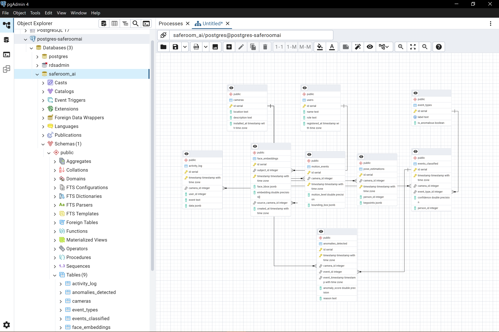

  

# SafeRoomAI-Showcase 🛡️📹

**A smart surveillance and workplace behavior analytics platform.**

This repository is a **curated portfolio showcase** of my contributions to *SafeRoomAI*, a capstone project developed as part of the AIDI-2005-02 course at Durham College. The goal of the project was to design and build an AI-powered video surveillance system that processes live camera feeds for security and human resource management, using real-time detection, behavioral analytics, and interactive dashboards.

> 💡 Think of it as the "Stripe of AI-powered workplace surveillance and HR analytics."

---

## 🔍 Project Overview

**SafeRoomAI** is a modular, API-first platform that transforms raw surveillance video into structured, actionable intelligence in real time. It supports:

- **Motion and object detection** (e.g., detecting people, vehicles)

  

- **Facial recognition and action classification** (e.g., loitering, entering restricted areas)

  

- **Anomaly detection** (e.g., off-hour entry, irregular behavior)

  

- **Activity feed interface** for real-time incident monitoring

  

- **Analytics dashboard** for space usage and staff behavior patterns

  

---

## 💼 My Role

I served as the **Product Manager**, **Computer Vision Lead**, and **Data/Backend Engineer**. Specifically, I:

- **Ideated and defined** the project concept, system goals, and full feature set
- Built the **motion and object detection pipeline** using **YOLOv8** and **OpenCV**
- Designed and implemented parts of the **backend infrastructure**:
  - AWS S3 for media storage
  - PostgreSQL and AWS RDS for activity logging and metadata
- Developed **ETL pipelines** for video preprocessing, annotation, and storage
- Contributed to the **agentic AI module**, building toward autonomous insight extraction

  

---

## 🧠 Core AI Features

| Feature                     | Technology Used                    | Description |
|----------------------------|-------------------------------------|-------------|
| **Motion/Object Detection** | YOLOv8, OpenCV                     | Real-time detection of people, objects, and vehicles |
| **Face Recognition**        | FaceNet, DeepFace (planned)        | Identify specific employees in footage |
| **Action Recognition**      | Pose Estimation + GRU              | Classify behaviors like walking, loitering |
| **Anomaly Detection**       | Clustering, Autoencoders           | Flag behavior that deviates from learned norms |
| **Agentic AI**              | Prompted LLM + Rule-based Filters  | Surface only the most meaningful insights automatically |

---

## 🖥️ UI Components

- **Activity Feed**: Swipeable feed of events, powered by real-time camera input
- **Analytics Dashboard**: Charts and metrics showing employee movement and space usage
- **Interactive API**: FastAPI backend serving JSON responses to the frontend dashboard

Frontend built in **React** + **TailwindCSS** by frontend team members.

---

## 🛠️ Tech Stack

- **AI/ML Models**: YOLOv8, GRU, MediaPipe, Autoencoders
- **Backend**: FastAPI, PostgreSQL (via AWS RDS), AWS S3
- **Data Engineering**: ETL scripts, video preprocessing pipelines
- **Frontend**: React, Tailwind, Chart.js
- **Infra**: Docker, Railway (dev deployment)

---

## 🗂️ Project Structure

## 🔗 Related Links

- 📎 [Original Capstone Repo (Upstream)](https://github.com/DC-Capstone1W25/SafeRoomAI)
- 📽️ Final Presentation (Coming soon)

---

## 📣 License & Disclaimer

This repo is a personal showcase. For collaboration, feature contributions, or production use, please contact me directly or refer to the original repository.

---
